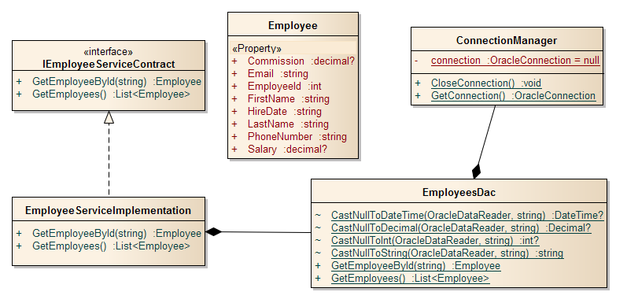
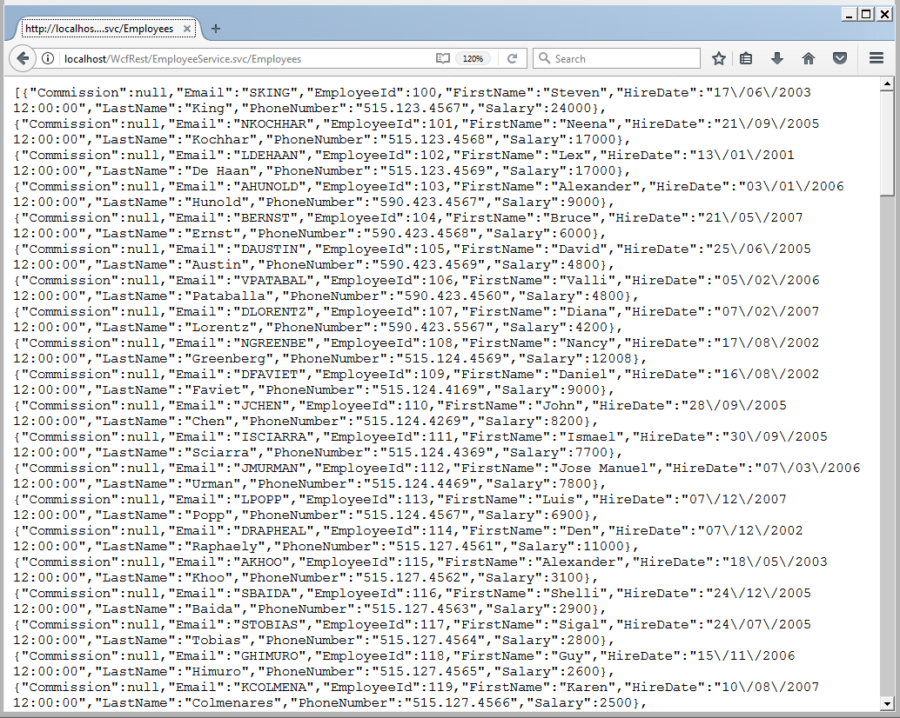
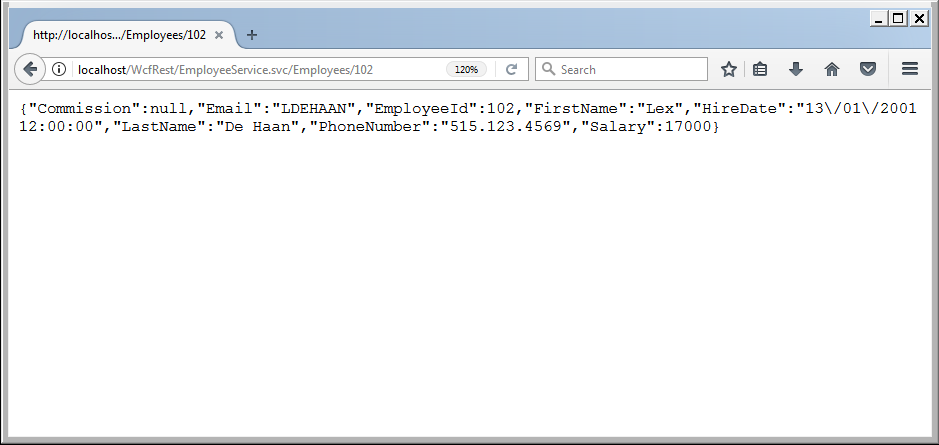
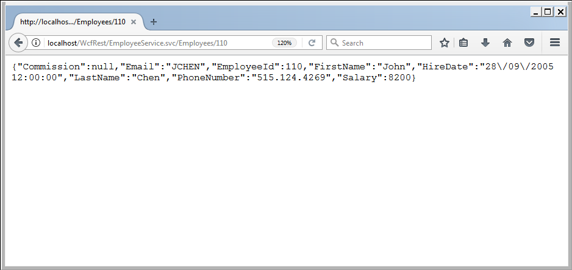

# Understanding RESTFul services with Windows Communication Foundation (WCF) and Oracle HR Schema

What Are RESTful Web Services?

REST stands for Representational State Transfer is an architectural style rather than a prescribed way of building Web services, some of the most important aspects of the REST environment are:

<ul>
<li>HTTP or HTTPS may be used as the transfer protocol.</li>
<li>URLs including query strings are used to address resources.</li>
<li>Representation formats supported range from HTML and XML to JSON and ATOM.</li>
<li>A Simple and intuitive programming interface is achieved by using HTTP verbs and status codes.</li>
<li>Statelessness in the interaction between clients and services.</li>
</ul>

REST is not concerned with the definition of messages and the design of methods, the key point here is that REST describes a stateless, hierarchical scheme for representing resources and business objects over a network. The main components of this model are: resources and actions. The action of the resource is determined by four main HTTP verbs: GET, PUT, DELETE and POST, and the action which can affect those resources are mainly CRUD (Create, Read, Update and Delete) methods, the success of the action is found by the HTTP status code.

The REST model relies on the application that accesses the data sending the appropriate HTTP verb as part of the request used to access the data.
<ul>
<li><b>GET</b> is used exclusively to retrieve data and, therefore, the result can also be buffered.</li>
<li><b>POST</b> is used to add new records.</li>
<li><b>PUT</b> is used to add or change a resource.</li>
<li><b>DELETE</b> is used for delete resources.</li>
</ul>
The data can be returned in a number of formats, but for portability the most common formats include XML (POX) and JSON.

<h3>WCF and REST</h3>

The REST architecture is becoming increasingly common, and WCF provides attributes, methods, and types with which you can build and access REST Web Services quickly and easily.

<ul>
<li><strong>WebHttpBinding:</strong> An binding that uses the HTTP transport and text message encoder.</li>
<li><strong>WebBehavior:</strong> This is an endpoint behavior that will modify the dispatch layer on all operations on a contract. The modifications cause messages to be dispatched to methods on your service based on URIs and HTTP verbs.</li>
<li><strong>WebServiceHost:</strong> This is a ServiceHost-derived class that simplifies the configuration of a web-based service.</li>
<li><strong>WebOperationContext:</strong> This is a new context object, which contains the state of the incoming request and ongoing response, and simplifies coding against HTTP using WCF.</li>
<li><strong>WebGetAttribute/WebInvokeAttribute:</strong> Operation behaviors that are applied as attributes on a ServiceContract's methods.WebGetAttribute is for GET verb and WebInvokeAttribute is for all the other verbs. It also tells the dispatcher how to match the methods to URIs and how to parse the URI into method parameters.
</li>
</ul>

<b>The following table shows the properties of both WebGetAttribute and WebInvokeAttribute.</b> 
<table>
<tr>
<td>Method</td>
<td>The HTTP verb the method should respond to.</td>
</tr>
<tr>
<td>UriTemplate</td>
<td>The definition of the URI the CLR method should respond to.</td>
</tr>
<tr>
<td>RequestFormat</td>
<td>Enumeration that specifies the format for deserializing the request (Xml or Json).</td>
</tr>
<tr>
<td>ResponseFormat</td>
<td>Enumeration that specifies the format for serializing the response (Xml or Json).</td>
</tr>
<tr>
<td>BodyStyle</td>
<td>Enumeration that specifies whether the request and the response data should be wrapped in an element with the same name as the CLR method name. Bare is typically used with RESTful services.</td>
</tr>
</table>

The essential components to construct a REST Service with WFC can be found in System.ServiceModel.Web assembly. However, the most important part of the process is designing the schema that you will use to provide access to the resources exposed by the service. So the main idea behind REST is to design your URIs in a way that makes logical sense based on your resource set. The URIs should, if possible, make sense to the application that consumes the data.

Depending on the volume of data in the database, a query might retrieve a large number of items, therefore, it makes sense to provide additional query parameters that a user can specify to limit the number of items returned.

<h3>Implementing a simple RESTful Service Example with WCF and Oracle.</h3>

In this example, we will develop a WCF RESTful service by using <a href="https://github.com/oracle-samples/db-sample-schemas">Oracle HR Sample Schema</a>, ODP.NET, ADO.NET and Visual Studio.
You can learn about the HR Schema in this <a href="https://github.com/lynxestudio/20190106-OracleSchema">post</a>, I have written to introduce you to this schema. 
The following illustration shows the components in the Employee service that I have written for this post.

Fig 1. Components of our Employee RESTFul service.

In this example a GET at http://localhost/WcfRest/EmployeeService.svc/Employees shows all the employees in the HR database.
Fig 2. Running the example, querying all the employees.

Here a GET at http://localhost/WcfRest/EmployeeService.svc/102 show only one employee with the ID 102.
Fig 3. Querying only one employee.

Also, a GET at http://localhost/WcfRest/EmployeeService.svc/110 show the employee with the ID 110.
Fig 4. Querying another employee.

